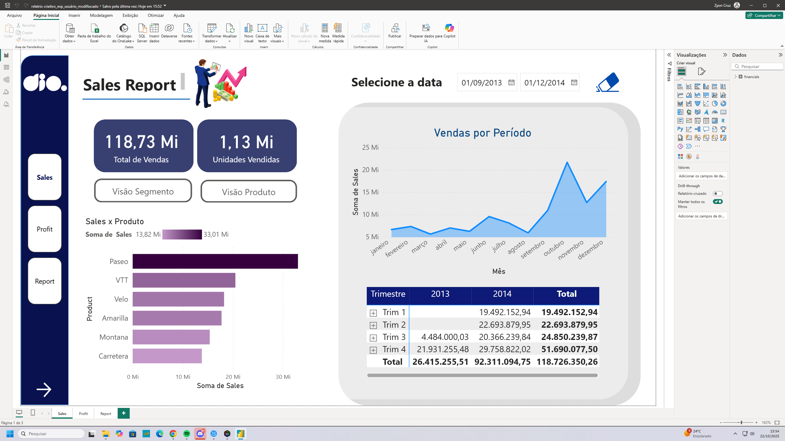
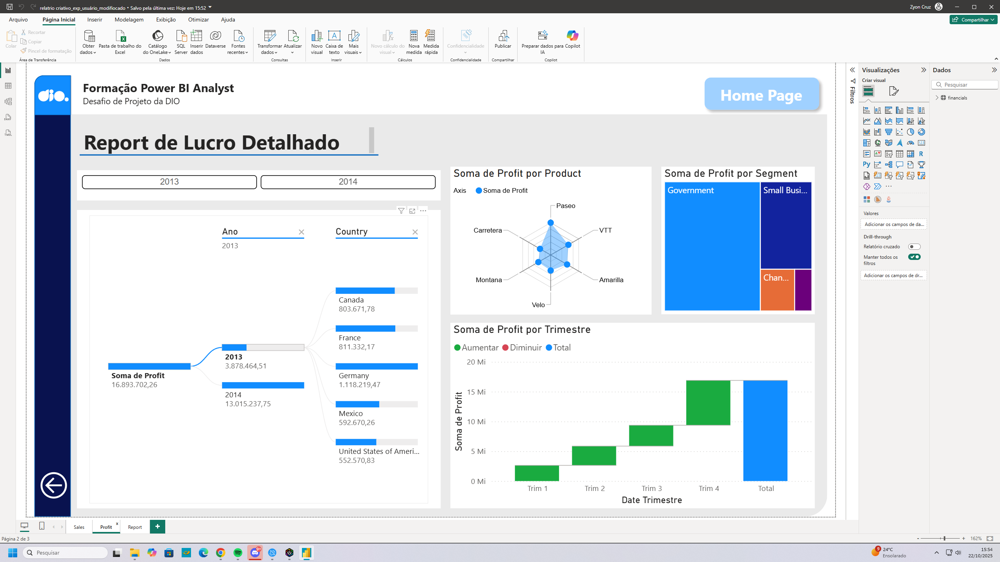
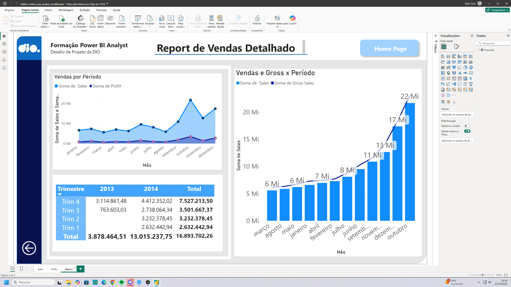

# Dashboard-Gerencial-com-Foco-em-UX-e-Navega-o-no-Power-BI
# Desafio DIO: Dashboard Gerencial com Foco em UX/UI no Power BI

Este repositório contém a solução para o desafio de projeto da DIO "Criando um Dashboard Gerencial para Tomada de Decisões". O foco principal foi refatorar um relatório existente, aplicando conceitos avançados de **User Experience (UX)** e **Navegabilidade**.

## 1. Objetivo do Desafio
O objetivo não era apenas criar visuais, mas sim melhorar a experiência do usuário final (como um gerente ou diretor). Para isso, o desafio foi baseado em 4 pilares de design e UX:

1.  **Posicionamento:** Colocar as informações mais importantes (KPIs) em locais de destaque (canto superior esquerdo).
2.  **Contraste:** Garantir que o relatório seja "clean" e fácil de ler, com uma paleta de cores profissional e bom contraste entre fundos e textos.
3.  **Proporção Áurea:** Criar uma hierarquia visual clara, com gráficos principais maiores e gráficos secundários menores, guiando o olhar do usuário.
4.  **Segmentação dos Dados:** Agrupar os filtros (slicers) de forma lógica e acessível.

## 2. A Solução Implementada
Para atender a esses requisitos, o relatório foi estruturado em um formato "Hub-and-Spoke" (uma página central que distribui para as páginas de detalhe), composto por 3 páginas:

* **Página 1: Home Page (Sales Report)**
    * Funciona como o "hub" central.
    * Apresenta os KPIs principais (Total de Vendas, Unidades Vendidas) e um menu de navegação vertical à esquerda.
    * Contém filtros globais de data.

* **Página 2: Report de Lucro Detalhado**
    * Uma página de "detalhe" (spoke) focada em Profit.
    * Contém filtros específicos de Ano e País.
    * Inclui um botão "Home Page" para retornar ao hub central.

* **Página 3: Report de Vendas Detalhado**
    * A segunda página de detalhe, focada em Sales.
    * Mantém a identidade visual e o botão "Home Page" para garantir a consistência.

### Navegabilidade com Botões e Indicadores
O principal recurso de UX implementado foi o sistema de navegação:

* **Indicadores (Bookmarks):** Foi criado um indicador para "salvar" a visualização de cada uma das 3 páginas.
* **Botões com Ação:** Os botões no menu vertical ("Sales", "Profit", "Report") e os botões "Home Page" foram configurados com uma **Ação** do tipo **Indicador**, permitindo que o usuário navegue entre as telas de forma fluida e intuitiva, como se estivesse em um site.
* **Estilização de Botões:** Os botões foram estilizados para responder ao "focalizar" (hover) do mouse, melhorando o feedback visual para o usuário.

## 3. Screenshots do Relatório Final
### Página 1 - Home Page (Hub)

### Página 2 - Detalhe de Lucro (Spoke 1)

### Página 3 - Detalhe de Vendas (Spoke 2)

